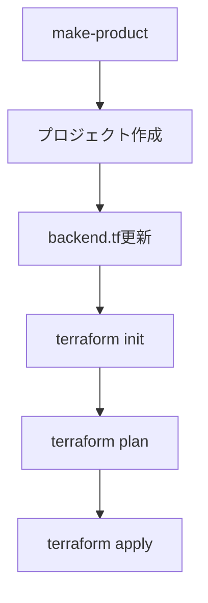

# アーキテクチャ概要

## プロジェクト構成

```
study_v2/
├── backend/              # Terraformバックエンド用インフラ
├── common/              # 共通設定・リソース
├── docs/                # ドキュメント
├── modules/             # 再利用可能なTerraformモジュール
├── product/             # 実際のプロダクト/プロジェクト
└── templates/           # プロジェクトテンプレート
```

## 設計原則

### 1. モジュール化
- 各AWSサービスごとにモジュール分離
- 再利用性を重視した設計
- 標準的なインプット/アウトプット

### 2. テンプレート駆動
- `make-product`コマンドでプロジェクトを標準化
- 一貫したディレクトリ構造
- 設定のテンプレート化

### 3. リモートバックエンド
- S3によるstateファイル管理
- DynamoDBによるロック機能
- 複数プロジェクト間での状態管理

## 推奨ワークフロー



## セキュリティ考慮事項

- AWSクレデンシャルの適切な管理
- S3バケットの暗号化
- IAMロールの最小権限原則
- .gitignoreによる機密情報の除外