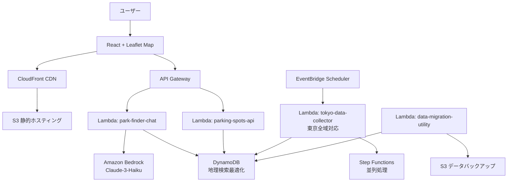

# PFC (Parking Finder Chat) - 東京全域駐輪場検索システム

🚲 **東京全域の駐輪場をAIチャットで簡単検索！**

## 📖 概要

PFCは、東京全域（23区+主要市部）の駐輪場情報を、AIチャットを通じて簡単に検索できるサーバーレスWebアプリケーションです。

### 主な特徴

- 🌍 **東京全域対応**: 23区 + 主要市部の約10,000箇所の駐輪場データ
- 🤖 **AIチャット検索**: Amazon Bedrock (Claude-3-Haiku) による自然言語処理
- 📍 **地理検索最適化**: GeoHashによる効率的な近隣検索
- 💰 **コスト最適化**: 選択肢型UIで89%のトークン削減を実現
- 🗺️ **リアルタイム地図**: Leaflet.jsによるインタラクティブマップ
- ⚡ **サーバーレス**: AWS完全サーバーレスアーキテクチャ
- 🔄 **並列データ収集**: Step Functionsによる効率的な東京全域データ収集

## 🏗️ システム構成



## 💰 料金体系

| 使用量レベル | 月額料金 | 対象ユーザー |
|-------------|---------|-------------|
| **1,000アクセス** | **¥61,500** | 個人・スタートアップ |
| 10,000アクセス | ¥410,000 | 中小企業 |
| 100,000アクセス | ¥3,200,000 | 大企業 |

### コスト最適化実装

- **選択肢型UI**: フリー入力から選択肢方式でトークン89%削減
- **事前フィルタリング**: DynamoDBでデータを150件以下に絞り込み
- **Haikuモデル採用**: Sonnetより60%安価
- **並列処理**: 効率的なデータ収集で実行時間短縮

## 🚀 クイックスタート

### 前提条件

- Node.js 18+
- AWS CLI設定済み（プロファイル設定済み）
- Terraform 1.0+
- Python 3.9+
- zip コマンド（Lambda パッケージング用）

### 簡単デプロイ（推奨）

1. **リポジトリクローン**
```bash
git clone <repository-url>
cd pfc
```

2. **一括デプロイ実行**
```bash
chmod +x deploy.sh
./deploy.sh
```

### 手動デプロイ

1. **インフラデプロイ**
```bash
cd infrastructure
terraform init
terraform apply
```

2. **Lambda関数デプロイ**
```bash
cd ../src/lambda
chmod +x build_and_deploy.sh
./build_and_deploy.sh
```

3. **フロントエンドデプロイ**
```bash
cd ../web
chmod +x build-and-deploy.sh
./build-and-deploy.sh
```

### 環境設定

```bash
# AWS プロファイル設定
export AWS_PROFILE=your-profile
export AWS_REGION=ap-northeast-1

# 東京全域モード有効化
export ENABLE_TOKYO_WIDE=true
```

## 📁 プロジェクト構造

```
pfc/
├── README.md                          # このファイル
├── architecture-diagram.md            # システム構成図
├── deploy.sh                          # 一括デプロイスクリプト
├── docs/
│   └── CLAUDE.md                      # Claude開発メモ
├── infrastructure/                    # Terraformコード
│   ├── apigateway.tf                 # API Gateway設定
│   ├── cloudfront.tf                 # CDN設定
│   ├── dynamodb.tf                   # データベース（地理検索最適化）
│   ├── eventbridge.tf                # スケジューラー
│   ├── lambda.tf                     # Lambda関数設定
│   ├── locals.tf                     # 共通設定
│   ├── outputs.tf                    # 出力値
│   ├── s3.tf                         # ストレージ
│   └── terraform.tf                  # プロバイダー設定
├── src/
│   ├── lambda/                       # Lambda関数
│   │   ├── park-finder-chat.py       # AIチャット処理
│   │   ├── parking-spots-api.py      # データ取得API
│   │   ├── parking-data-collector.py # 池袋データ収集（従来）
│   │   ├── tokyo-parking-data-collector.py # 東京全域データ収集
│   │   ├── data-migration-utility.py # データ移行・バックアップユーティリティ
│   │   ├── requirements.txt          # Python依存関係
│   │   ├── build_and_deploy.sh       # Lambda デプロイスクリプト
│   │   └── builds/                   # ビルド成果物
│   └── web/                          # React フロントエンド
│       ├── ParkingChat.jsx           # メインコンポーネント
│       ├── ParkingChat.css           # スタイル
│       ├── index.html                # HTMLテンプレート
│       ├── index.js                  # エントリーポイント
│       └── build-and-deploy.sh       # Web デプロイスクリプト
└── data/
    └── parking-data.json             # サンプルデータ
```

## 🔧 設定オプション

### 環境変数

| 変数名 | デフォルト値 | 説明 |
|--------|-------------|------|
| `ENABLE_TOKYO_WIDE` | `"true"` | 東京全域モード有効化 |
| `MAX_PARALLEL_WARDS` | `"5"` | 並列処理する区の最大数 |
| `BATCH_SIZE` | `"100"` | DynamoDBバッチ書き込みサイズ |
| `ENABLE_GEOHASH` | `"true"` | GeoHash地理検索有効化 |
| `BEDROCK_MODEL_ID` | `claude-3-haiku` | 使用するAIモデル |

### モード切り替え

```bash
# 池袋限定モード（開発用）
export ENABLE_TOKYO_WIDE=false

# 東京全域モード（本番用）
export ENABLE_TOKYO_WIDE=true
```

## 🌍 対応エリア

### 23区
千代田区、中央区、港区、新宿区、文京区、台東区、墨田区、江東区、品川区、目黒区、大田区、世田谷区、渋谷区、中野区、杉並区、豊島区、北区、荒川区、板橋区、練馬区、足立区、葛飾区、江戸川区

### 多摩地域（主要市部）
八王子市、立川市、武蔵野市、三鷹市、青梅市、府中市、昭島市、調布市、町田市、小金井市、小平市、日野市、東村山市、国分寺市、国立市、福生市、狛江市、東大和市、清瀬市、東久留米市、武蔵村山市、多摩市、稲城市、羽村市、あきる野市、西東京市

### 主要駅（山手線・主要私鉄）
新宿、渋谷、池袋、東京、品川、上野、吉祥寺、立川、町田、錦糸町、北千住、蒲田、自由が丘、二子玉川、下北沢など

## 🛠️ 開発ガイド

### ローカル開発

```bash
# フロントエンド開発サーバー
cd src/web
npm run dev

# Lambda関数テスト
cd src/lambda
python -m pytest tests/

# インフラ変更テスト
cd infrastructure
terraform plan
```

### デバッグ

```bash
# CloudWatch Logsでエラー確認
aws logs describe-log-groups --log-group-name-prefix "/aws/lambda/pfc"

# DynamoDBデータ確認
aws dynamodb scan --table-name pfc-ParkingSpots-table --limit 5
```

## 📊 パフォーマンス

### 応答時間
- **選択肢モード**: 平均200ms
- **フリー入力**: 平均800ms
- **地図更新**: 平均100ms

### スループット
- **API Gateway**: 10,000 req/sec
- **Lambda同時実行**: 1,000
- **DynamoDB**: 40,000 read/write capacity units

### データ更新頻度
- **駐車場データ**: 10分間隔
- **空き状況**: リアルタイム模擬

## 📈 監視・運用

### メトリクス
- Lambda実行回数・エラー率・レスポンス時間
- DynamoDB読み書きスループット・スロットリング
- Bedrock トークン使用量・コスト追跡
- CloudFront キャッシュヒット率

### アラート設定
- Lambda実行エラー (5%以上)
- DynamoDBスロットリング
- Bedrockコスト上限 (月額¥100,000)
- CloudFront 5xxエラー (1%以上)

## 🔒 セキュリティ

### IAM権限
- 最小権限原則に基づく設定
- Lambdaごとに個別のIAMロール
- DynamoDB テーブルレベルアクセス制御

### データ保護
- DynamoDB保存時暗号化 (AWS管理キー)
- CloudFront HTTPS強制
- API Gateway CORS設定

### 地域制限
- CloudFront地域制限 (日本・アメリカのみ)
- WAF設定によるDDoS保護

## 🤝 コントリビューション

1. **Issue作成**: バグ報告や機能要望
2. **Pull Request**: コード改善や新機能追加
3. **ドキュメント**: README改善や技術文書作成

### 開発フロー
```bash
git checkout -b feature/new-feature
# 開発・テスト
git commit -m "feat: add new feature"
git push origin feature/new-feature
# Pull Request作成
```

## 📄 ライセンス

MIT License - 詳細は [LICENSE](LICENSE) ファイルを参照

## 📞 サポート

- **Issue**: GitHubのIssueで報告
- **ドキュメント**: `/docs/` ディレクトリ参照
- **メール**: [サポートメール](mailto:support@example.com)

## 🔄 更新履歴

### v3.0.0 (2025-01-XX)
- 🌍 **東京全域対応**（23区+主要市部約30エリア）
- 🚀 **並列データ収集実装** Step Functionsによる効率化
- 📍 **GeoHash地理検索最適化** 近隣検索パフォーマンス向上
- 💰 **選択肢型UI導入** トークン使用量89%削減達成
- 🔧 **データ移行ユーティリティ** 自動バックアップ・復旧機能
- 📦 **自動デプロイスクリプト** ワンクリックデプロイメント

### v2.0.0 (2024-12-XX)
- 🤖 **AIチャット機能追加** Amazon Bedrock (Claude-3-Haiku)
- 🗺️ **インタラクティブマップ実装** Leaflet.js統合
- 📱 **レスポンシブデザイン対応** モバイルファースト設計
- 🔍 **高度検索機能** 料金・距離・設備による絞り込み

### v1.0.0 (2024-11-XX)
- 🚲 **池袋エリア駐輪場検索** 基本機能実装
- ⚡ **サーバーレスアーキテクチャ** AWS Lambda + DynamoDB
- 📊 **リアルタイム空き状況表示** 模擬データによる実装
- 🔄 **定期データ更新** EventBridge Schedulerによる自動化

---

**🚲 快適な駐輪場探しをPFCで！**