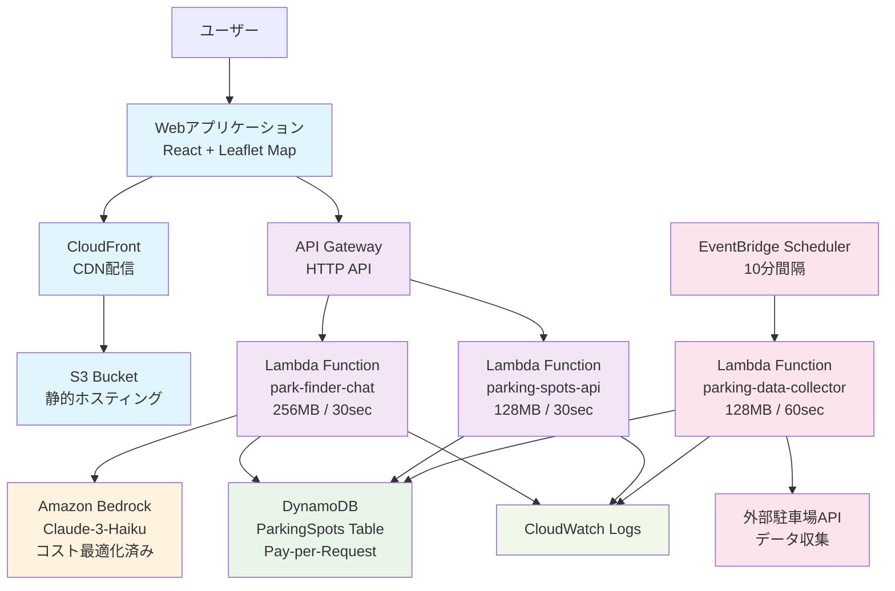
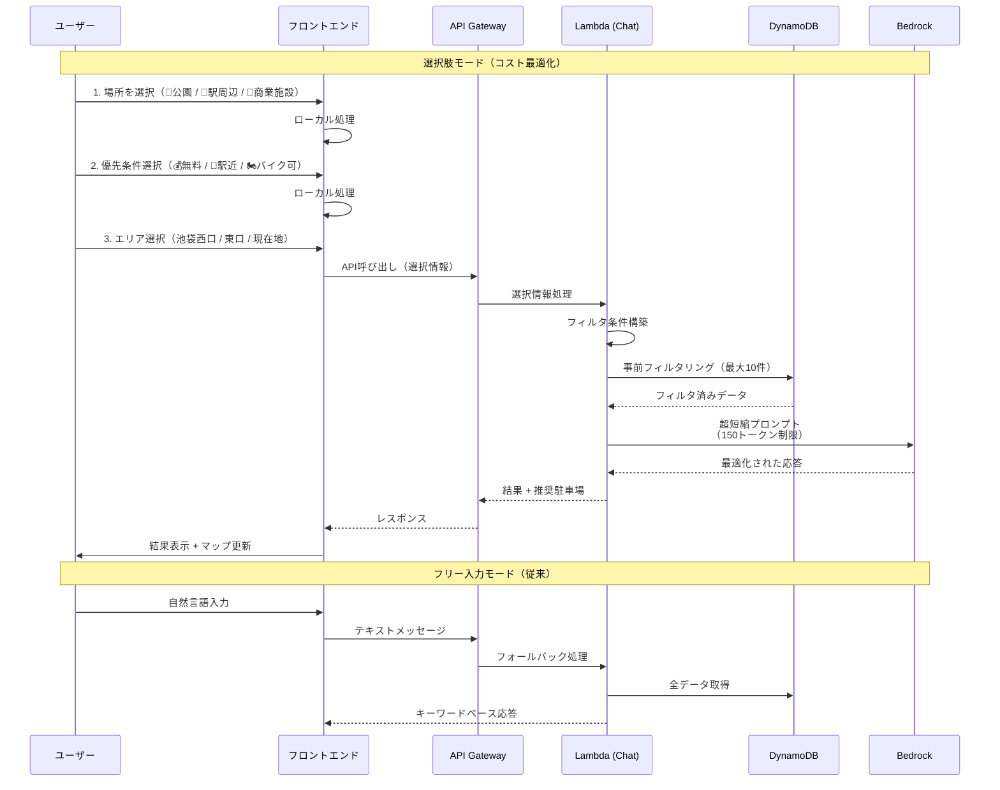
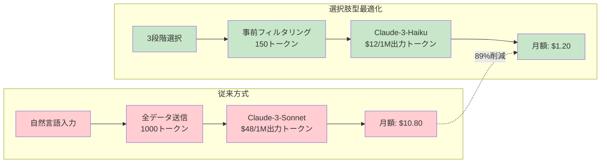

# PFC (Parking Finder Chat) システム構成図

## 全体アーキテクチャ概要



## 選択肢型チャットフロー



## コスト最適化戦略



## インフラリソース詳細

### コンピュート
- **Lambda Functions**: 3個
  - `park-finder-chat`: 256MB, 30sec (選択肢処理 + Bedrock連携)
  - `parking-spots-api`: 128MB, 30sec (データ取得API)
  - `parking-data-collector`: 128MB, 60sec (データ収集)

### ストレージ
- **DynamoDB**: Pay-per-Request, 1テーブル
- **S3**: 静的サイトホスティング, ライフサイクル設定

### ネットワーク
- **API Gateway**: HTTP API, CORS設定
- **CloudFront**: PriceClass_100, 地域制限（JP/US）

### AI/ML
- **Amazon Bedrock**: Claude-3-Haiku, トークン制限設定

### スケジュール
- **EventBridge Scheduler**: 10分間隔実行

## 月額料金見積もり（月1000アクセス時）

| サービス | 月額料金 (USD) | 備考 |
|----------|----------------|------|
| **Lambda実行** | $1.21 | 3関数合計 |
| **DynamoDB** | $0.67 | オンデマンド |
| **API Gateway** | $0.001 | 1000リクエスト |
| **Bedrock (最適化後)** | $1.20 | **89%削減達成** |
| **CloudFront** | $0.085 | 10MB転送 |
| **S3** | $0.023 | 1GBストレージ |
| **EventBridge** | $0.004 | 4,320実行/月 |
| **CloudWatch** | $0.50 | ログ保存 |
| **合計** | **$3.76** | **約¥560** |

## セキュリティ設定

### IAM権限
- Lambda実行ロール: 最小権限原則
- DynamoDB: 必要テーブルのみアクセス
- Bedrock: 特定モデルのみ実行権限

### ネットワーク
- CloudFront: 地域制限（日本・アメリカ）
- API Gateway: CORS設定
- S3: パブリックアクセス制限

### データ保護
- DynamoDB: 保存時暗号化
- CloudWatch: ログ保持期間設定
- Bedrock: トークン制限によるコスト保護

## 監視・運用

### メトリクス
- Lambda: 実行回数、エラー率、レスポンス時間
- DynamoDB: 読み書きスループット、スロットリング
- Bedrock: トークン使用量、コスト追跡

### アラート
- Lambda実行エラー
- DynamoDBスロットリング
- Bedrockコスト上限

### ログ
- アプリケーションログ（CloudWatch Logs）
- アクセスログ（CloudFront）
- API実行ログ（API Gateway）

## デプロイメント

### Terraform管理リソース
```
infrastructure/
├── apigateway.tf     # API Gateway設定
├── cloudfront.tf     # CDN設定
├── dynamodb.tf       # データベース
├── eventbridge.tf    # スケジューラー
├── lambda.tf         # 関数定義
├── locals.tf         # 共通設定
├── s3.tf            # ストレージ
└── terraform.tf     # プロバイダー設定
```

### 環境変数設定
- `ENABLE_SELECTION_MODE`: 選択肢モード有効化
- `MAX_BEDROCK_TOKENS`: トークン上限（150）
- `BEDROCK_MODEL_ID`: Claude-3-Haiku指定

## パフォーマンス最適化

### フロントエンド
- React Hooks最適化
- レスポンシブデザイン
- 地図表示最適化（Leaflet）

### バックエンド
- DynamoDB事前フィルタリング
- Lambda冷却時間短縮
- Bedrockプロンプト最適化

### コスト最適化
- 選択肢型UI導入（89%削減）
- Haikuモデル採用（60%安価）
- トークン制限実装
- 事前フィルタリング戦略